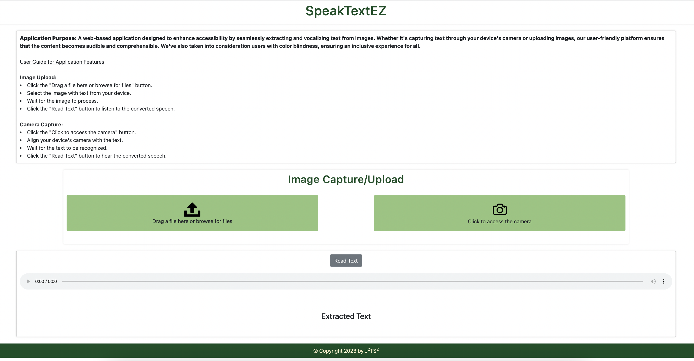

# SpeakTextEZ-Text-to-Speech-Web-App

## Application Purpose
A web-based application designed to enhance accessibility by seamlessly extracting
and vocalizing text from images. Whether it's capturing text through your device's camera or uploading images,
our user-friendly platform ensures that the content becomes audible and comprehensible.
We've also taken into consideration users with color blindness, ensuring an inclusive experience for all.

## Installation Instructions
There are two ways to access and experience the application:

### Online Access:
Simply visit the following link to directly interact with the user interface: [Application UI](https://asifshaafi.github.io/SpeakTextEZ-Text-to-Speech-Web-App/).

### Local Setup:
To run the application locally on your machine, follow these steps:
- Clone the repository to your local machine
- Navigate to your project and open the FrontEnd/index.html file in your preferred web browser to access the application

## Usage Guide

- Image Upload:
Click the "Upload Image" button.
Select an image containing text from your device.
Wait for the image to be processed.
Once processing is complete, click the "Read Text" button to listen to the converted speech.

- Camera Capture:
Click the "Capture Text" button.
Align your device's camera with the text you want to capture.
Wait for the application to recognize the text.
Click the "Read Text" button to hear the converted speech.

## Screenshot of UI
.

## Accessibility Information
The user interface is tailored to accommodate users with color blindness.

## Dependencies
- Google Cloud Platform:
This application is built on the Google Cloud Platform, utilizing the power of the Cloud Vision API for Optical Character Recognition (OCR) and the Cloud Text-to-Speech API for converting text to speech.

- Node.js and npm:
The application requires Node.js version 16 or later and npm version 9 for proper functionality.

- Please ensure you have the necessary Google Cloud APIs enabled and the correct versions of Node.js and npm installed to make the most out of the application's features.

## Contact Information
Feel free to reach out to any of our contributors for questions, feedback, or assistance regarding the application:
- [Jorge Yero](mailto:jorge_yero1@baylor.edu) 

- [Jie Ren](mailto:jie_ren1@baylor.edu)

- [Tingshuo Miao](mailto:tingshuo_miao2@baylor.edu)

- [Asif Imtiaz Shaafi](mailto:asifimtiaz_shaafi1@baylor.edu)

- [Sri Manjusha Tella](mailto:srimanjusha_tella1@baylor.edu)
